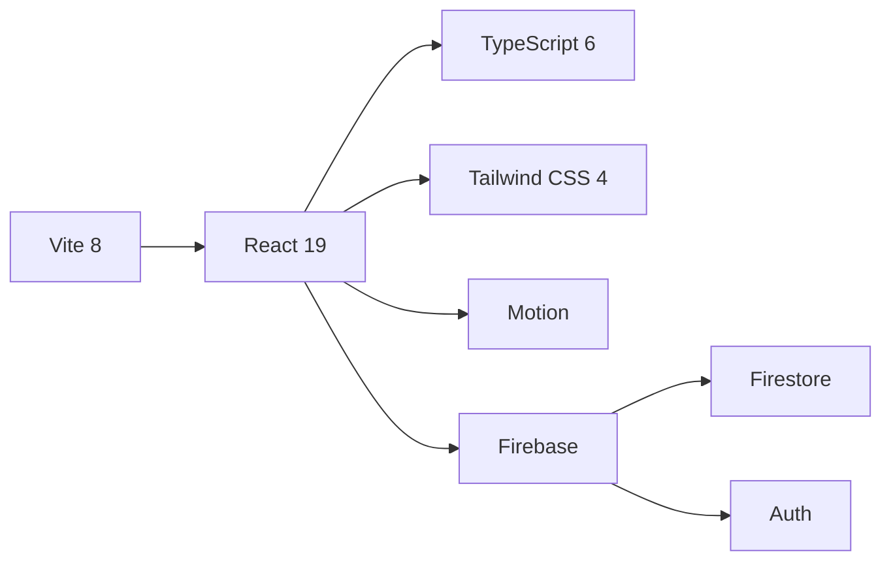

<div align="center">

# 🏠 Roomly

**Anonymous room-based chat. No sign-up. Just share a link.**


<kbd> <br> **Try it: [roomly-two.vercel.app](https://roomly-two.vercel.app)** <br> </kbd>

[](https://github.com/palnirupam/ROOMLY)

</div>

---

## ✨ Features at a Glance

<div align="center">

|                       |                                                         |
| --------------------- | ------------------------------------------------------- |
| 🔑 **Google Auth** | Instant access — one click with your Google account      |
| 🚀 **Create Room**    | One-click random room code generation — no manual entry |
| 🔗 **Invite Link**    | Share the link, friends join instantly                   |
| 🪪 **Room Codes**     | Or pick any custom code (1–50 chars)                    |
| ⚡ **Real-time Chat** | Messages appear instantly via Firestore live sync       |
| 🎨 **Nickname Colors**| Each user gets a unique color — easy to follow chat     |
| 👥 **Member Presence**| Live member count + "joined/left" toast notifications    |
| ⌨️ **Enter-to-Send**  | Enter sends, Shift+Enter for newline                    |
| 😊 **Emoji Picker**   | Quick emoji selection in messages                       |
| 🌙 **Dark Mode**      | Toggle theme — light ↔ dark                             |
| 📜 **Smooth Scroll**  | Fluid auto-scroll, RAF-throttled, invisible scrollbars  |
| 🗑️ **Room Deletion**  | Creator can nuke all messages & the room in one click   |
| 📱 **Mobile Ready**   | Responsive layout with safe-area insets                 |
| ♿ **Accessible**     | ARIA labels, live regions, keyboard nav, reduced-motion |

</div>

---

## 🧱 Tech Stack



| Layer                                                                                                                       | Technology                | Purpose                        |
| --------------------------------------------------------------------------------------------------------------------------- | ------------------------- | ------------------------------ |
|  **Framework**          | React 19                  | UI components & hooks          |
|  **Language** | TypeScript 6              | Type safety                    |
| ⚡ **Build**                                                                                                                | Vite 8                    | HMR dev server & bundling      |
| 🎨 **Styling**                                                                                                              | Tailwind CSS 4            | Utility-first CSS              |
| 🎬 **Animation**                                                                                                            | Motion (Framer Motion)    | Enter/exit & layout animations |
| 🔥 **Backend**                                                                                                              | Firebase Firestore + Auth | Real-time DB & Google auth     |
| 🧹 **Linting**                                                                                                              | ESLint 10                 | Zero-warnings enforcement      |
| ✨ **Formatting**                                                                                                           | Prettier                  | Consistent code style          |
| 🪝 **Git Hooks**                                                                                                            | Husky + lint-staged       | Pre-commit checks              |

---

## 🚀 Getting Started

### Prerequisites

- **Node.js** 22+
- **npm**
- A **Firebase project** with:
  - Firestore Database
  - Google Authentication enabled

### 1. Clone

```bash
git clone https://github.com/palnirupam/ROOMLY.git
cd ROOMLY
```

### 2. Install

```bash
npm install
```

### 3. Configure Firebase

```bash
cp .env .env.local
```

Edit `.env.local` with your Firebase project credentials:

```
VITE_FIREBASE_API_KEY=AIzaSy...
VITE_FIREBASE_AUTH_DOMAIN=your-project.firebaseapp.com
VITE_FIREBASE_PROJECT_ID=your-project
VITE_FIREBASE_STORAGE_BUCKET=your-project.firebasestorage.app
VITE_FIREBASE_MESSAGING_SENDER_ID=123456789
VITE_FIREBASE_APP_ID=1:123...web:abc123
```

### 4. Deploy Firestore Rules

```bash
npx firebase deploy --only firestore:rules
```

### 5. Run

```bash
npm run dev
```

Open **[http://localhost:5173](http://localhost:5173)** 🎉

---

## 📂 Project Structure

```
src/
├── app/
│   ├── App.tsx                   # Root — providers & router
│   ├── router.tsx                # Route config (lazy-loaded)
│   ├── error/AppErrorBoundary.tsx
│   ├── routes/RouteFallback.tsx  # Suspense fallback
│   └── theme/ThemeProvider.tsx   # Dark/light mode
│
├── features/
│   ├── auth/
│   │   ├── AuthContext.tsx       # Auth state provider
│   │   └── AuthGate.tsx         # Blocks until authenticated
│   │
│   ├── chat/
│   │   ├── components/
│   │   │   ├── ChatHeader.tsx    # Room info, member count, delete, theme
│   │   │   ├── EmptyChat.tsx     # "No messages yet"
│   │   │   ├── LoadingSkeleton.tsx
│   │   │   ├── MessageBubble.tsx # Single message card with colored nickname
│   │   │   ├── MessageComposer.tsx # Input + send, Enter-to-send
│   │   │   └── MessageList.tsx   # Scroll container with date separators
│   │   ├── messageService.ts     # Firestore CRUD
│   │   ├── types.ts
│   │   └── useMessages.ts        # Messages hook
│   │
│   └── rooms/
│       ├── components/JoinRoomForm.tsx  # Create or join room
│       ├── memberService.ts             # Member presence (join/leave/subscribe)
│       ├── roomService.ts               # Join/create/delete room + random code gen
│       ├── roomErrors.ts
│       └── validation.ts                # Nickname & room code rules
│
├── firebase/
│   ├── auth.ts                   # Google sign-in
│   ├── config.ts                 # Firebase init
│   └── firestore.ts
│
├── pages/
│   ├── ChatPage.tsx              # Chat room with member tracking
│   ├── JoinPage.tsx              # Join/create room page (redirect support)
│   └── NotFoundPage.tsx
│
├── shared/
│   ├── config/env.ts             # VITE_* env bindings
│   ├── lib/cn.ts                 # clsx + tailwind-merge
│   ├── lib/userColor.ts          # Per-user color derivation
│   └── ui/                       # Button, Card, ConfirmModal, Container, 
│                                  # EmojiPicker, Header, Input, MemberToast, 
│                                  # PageTransition, Skeleton
│
└── styles/global.css             # Tailwind imports + utilities
```

---

## 🔄 Architecture

### Authentication Flow

```
App mount
  ↓
AuthProvider → signInWithPopup(GoogleAuthProvider)
  ↓
onAuthStateChanged → user.uid, user.displayName available
  ↓
AuthGate → renders children (or loading/error)
```

Google sign-in with `browserLocalPersistence` keeps the session alive across page refreshes.

### Join & Create Room

```
Join Page
  ├── [Create New Room] → auto-generates 6-char code (e.g. a8F3mK)
  │     ↓
  │   createNewRoom() → joinOrCreateRoom(roomCode) → navigate to /room/...
  │
  └── Enter room code manually → [Join Room]
        ↓
      joinOrCreateRoom(roomCode) → navigates to /room/...

Direct link (/room/a8F3mK):
  └── sessionStorage has nickname? → Enter room
      No? → Redirect to /join?code=a8F3mK (code pre-filled)
```

### Member Lifecycle

```
ChatPage loads
  ↓
joinRoom(roomCode, uid, nickname) → creates Firestore doc
  ↓
subscribeToMembers() ← onSnapshot
  ↓
Detect new/removed members
  ├── New member → toast: "Rupam joined"
  └── Member left → toast: "Rupam left"
  ↓
Cleanup on unmount or tab close:
  leaveRoom(roomCode, uid) → deletes member doc
```

### Room Lifecycle

```
User creates or joins a room
  ↓
success → navigate to /room/{roomCode}
  ↓
subscribeToMessages() [onSnapshot, limit 100]
  ↓
Messages appear in real-time
  ↓
(Optionally — creator clicks Delete)
  ↓
deleteRoom() → paginated batch delete messages + members → delete room doc
```

### Data Model

```
/rooms/{roomCode}
├── roomCode: string        # Unique, 1–50 chars, no / ? #
├── createdByUid: string    # Google UID
├── createdAt: Timestamp
└── schemaVersion: number

/rooms/{roomCode}/messages/{autoId}
├── clientMessageId: string  # UUID (dedup)
├── createdAt: Timestamp
├── senderNickname: string
├── senderUid: string
└── text: string             # 1–500 chars

/rooms/{roomCode}/members/{userId}
├── nickname: string
└── joinedAt: Timestamp
```

### Scroll System

```
                     ┌─────────────────────┐
                     │   ChatHeader (fixed) │
┌────────────────────┼─────────────────────┤
│  Scroll Container  │  🧾 Message 1       │
│  (flex-1,          │  🧾 Message 2       │
│   overflow-y-auto) │  🧾 Message 3       │
│                    │  ...                │
│  ✓ RAF-throttled   │  🧾 New message     │
│  ✓ Auto-scroll     │                     │
│  ✓ Hidden bars     └─────────────────────┤
│                    │   MessageComposer    │
└────────────────────┴─────────────────────┘
```

- Scroll events coalesced via `requestAnimationFrame` (max 1 per frame)
- `contain: layout style paint` isolates rendering
- `scrollbar-width: none` + `::-webkit-scrollbar` hide bars while keeping scroll functional
- 96px "near bottom" threshold for auto-scroll

---

## 🛡️ Security Rules

| Action                  | Rule                                                           |
| ----------------------- | -------------------------------------------------------------- |
| Room create             | Signed-in, valid code, `createdByUid` = caller                 |
| Room read               | Signed-in, valid code                                          |
| Room delete             | Only `createdByUid`                                            |
| Room listing            | ❌ Denied                                                      |
| Message create          | Signed-in, room exists, `senderUid` = caller, validated fields |
| Message read/list       | Signed-in, limit ≤ 100                                         |
| Message delete          | Only room creator (via `get()` on parent room)                 |
| Member create           | Signed-in, `userId` = caller, valid nickname                   |
| Member read/list        | Signed-in, valid code                                          |
| Member delete           | Signed-in, `userId` = caller                                   |

---

## 📜 Scripts

| Script                 | What it does                    |
| ---------------------- | ------------------------------- |
| `npm run dev`          | Start dev server with HMR       |
| `npm run build`        | `tsc -b && vite build`          |
| `npm run preview`      | Preview production build        |
| `npm run lint`         | ESLint — zero warnings enforced |
| `npm run format`       | Prettier — write all files      |
| `npm run format:check` | Prettier — check-only           |

---

## 🌐 Deployment

```bash
npm run build
```

Deploy `dist/` to any static host:

```bash
# Vercel (recommended)
# Connect GitHub repo → Vercel auto-deploys

# Firebase Hosting
npx firebase deploy --only hosting

# Netlify / Cloudflare Pages
# Point to dist/ as publish directory
```

---

<div align="center">

**Built with ❤️ using React & Firebase**

<sub>MIT License — feel free to use, modify, and share.</sub>

</div>
