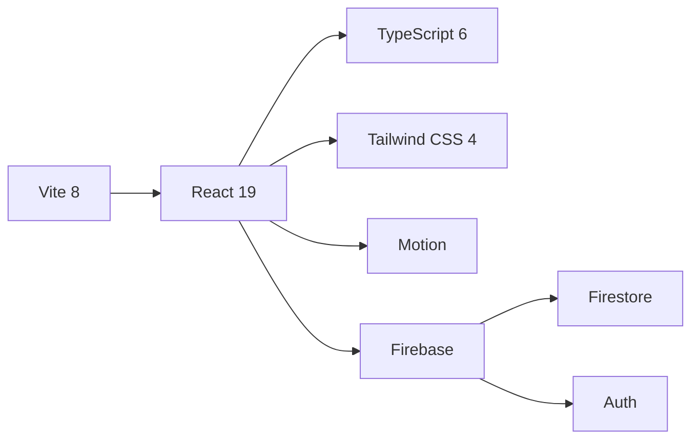

<div align="center">

# 🏠 Roomly

**Anonymous room-based chat. No sign-up. Just pick a room code.**


<kbd> <br> **Try it: [roomly.app](https://roomly-ddb2a.web.app)** <br> </kbd>

[](https://github.com/palnirupam/ROOMLY)

</div>

---

## ✨ Features at a Glance

<div align="center">

| | |
|---|---|
| 🔑 **Anonymous Auth** | Instant access — no email, no password, no account |
| 🪪 **Room Codes** | Pick any code (1–50 chars), share it, join. That's it. |
| ⚡ **Real-time Chat** | Messages appear instantly via Firestore live sync |
| 🌙 **Dark Mode** | Toggle theme — light ↔ dark |
| 📜 **Smooth Scroll** | Fluid auto-scroll, RAF-throttled, invisible scrollbars |
| 🗑️ **Room Deletion** | Creator can nuke all messages & the room in one click |
| 📱 **Mobile Ready** | Responsive layout with safe-area insets |
| ♿ **Accessible** | ARIA labels, live regions, keyboard nav, reduced-motion |

</div>

---

## 🧱 Tech Stack



| Layer | Technology | Purpose |
|---|---|---|
|  **Framework** | React 19 | UI components & hooks |
|  **Language** | TypeScript 6 | Type safety |
| ⚡ **Build** | Vite 8 | HMR dev server & bundling |
| 🎨 **Styling** | Tailwind CSS 4 | Utility-first CSS |
| 🎬 **Animation** | Motion (Framer Motion) | Enter/exit & layout animations |
| 🔥 **Backend** | Firebase Firestore + Auth | Real-time DB & anonymous auth |
| 🧹 **Linting** | ESLint 10 | Zero-warnings enforcement |
| ✨ **Formatting** | Prettier | Consistent code style |
| 🪝 **Git Hooks** | Husky + lint-staged | Pre-commit checks |

---

## 🚀 Getting Started

### Prerequisites

- **Node.js** 22+
- **npm**
- A **Firebase project** with:
  - Firestore Database (production mode)
  - Anonymous Authentication enabled

### 1. Clone

```bash
git clone https://github.com/<your-org>/roomly.git
cd roomly
```

### 2. Install

```bash
npm install
```

### 3. Configure Firebase

```bash
cp .env .env.local
```

Edit `.env.local` with your Firebase project credentials:

```
VITE_FIREBASE_API_KEY=AIzaSy...
VITE_FIREBASE_AUTH_DOMAIN=your-project.firebaseapp.com
VITE_FIREBASE_PROJECT_ID=your-project
VITE_FIREBASE_STORAGE_BUCKET=your-project.firebasestorage.app
VITE_FIREBASE_MESSAGING_SENDER_ID=123456789
VITE_FIREBASE_APP_ID=1:123...web:abc123
```

### 4. Deploy Firestore Rules

```bash
npx firebase deploy --only firestore:rules
```

### 5. Run

```bash
npm run dev
```

Open **[http://localhost:5173](http://localhost:5173)** 🎉

---

## 📂 Project Structure

```
src/
├── app/
│   ├── App.tsx                   # Root — providers & router
│   ├── router.tsx                # Route config (lazy-loaded)
│   ├── error/AppErrorBoundary.tsx
│   ├── routes/RouteFallback.tsx  # Suspense fallback
│   └── theme/ThemeProvider.tsx   # Dark/light mode
│
├── features/
│   ├── auth/
│   │   ├── AuthContext.tsx       # Auth state provider
│   │   └── AuthGate.tsx         # Blocks until authenticated
│   │
│   ├── chat/
│   │   ├── components/
│   │   │   ├── ChatHeader.tsx    # Room info, delete, theme
│   │   │   ├── EmptyChat.tsx     # "No messages yet"
│   │   │   ├── LoadingSkeleton.tsx
│   │   │   ├── MessageBubble.tsx # Single message card
│   │   │   ├── MessageComposer.tsx # Input + send
│   │   │   └── MessageList.tsx   # Scroll container
│   │   ├── messageService.ts     # Firestore CRUD
│   │   ├── types.ts
│   │   └── useMessages.ts        # Messages hook
│   │
│   └── rooms/
│       ├── components/JoinRoomForm.tsx
│       ├── roomService.ts        # Join/create/delete room
│       ├── roomErrors.ts
│       └── validation.ts         # Nickname & room code rules
│
├── firebase/
│   ├── auth.ts                   # signInAnonymously()
│   ├── config.ts                 # Firebase init
│   └── firestore.ts
│
├── pages/
│   ├── ChatPage.tsx
│   ├── JoinPage.tsx
│   └── NotFoundPage.tsx
│
├── shared/
│   ├── config/env.ts             # VITE_* env bindings
│   ├── lib/cn.ts                 # clsx + tailwind-merge
│   └── ui/                       # Button, Card, Container, Input, Skeleton
│
└── styles/global.css             # Tailwind imports + utilities
```

---

## 🔄 Architecture

### Authentication Flow

```
App mount
  ↓
AuthProvider → signInAnonymously()
  ↓
onAuthStateChanged → user.uid available
  ↓
AuthGate → renders children (or loading/error)
```

Firebase Anonymous Auth with `browserLocalPersistence` keeps the session alive across page refreshes.

### Room Lifecycle

```
User enters a room code
  ↓
joinOrCreateRoom() [Firestore transaction]
  ├── Room exists? → Join
  └── No? → Create (user = creator)
        ↓
subscribeToMessages() [onSnapshot, limit 100]
  ↓
Messages appear in real-time
  ↓
(User clicks Delete — creator only)
  ↓
deleteRoom() → paginated batch delete ← room doc delete
```

### Data Model

```
/rooms/{roomCode}
├── roomCode: string        # 1–50 chars [\w-]
├── createdByUid: string    # Anonymous UID
├── createdAt: Timestamp
└── schemaVersion: number

/rooms/{roomCode}/messages/{autoId}
├── clientMessageId: string  # UUID (dedup)
├── createdAt: Timestamp
├── senderNickname: string
├── senderUid: string
└── text: string             # 1–500 chars
```

### Scroll System

```
                     ┌─────────────────────┐
                     │   ChatHeader (fixed) │
┌────────────────────┼─────────────────────┤
│  Scroll Container  │  🧾 Message 1       │
│  (flex-1,          │  🧾 Message 2       │
│   overflow-y-auto) │  🧾 Message 3       │
│                    │  ...                │
│  ✓ RAF-throttled   │  🧾 New message     │
│  ✓ Auto-scroll     │                     │
│  ✓ Hidden bars     └─────────────────────┤
│                    │   MessageComposer    │
└────────────────────┴─────────────────────┘
```

- Scroll events coalesced via `requestAnimationFrame` (max 1 per frame)
- `contain: layout style paint` isolates rendering
- `scrollbar-width: none` + `::-webkit-scrollbar` hide bars while keeping scroll functional
- 96px "near bottom" threshold for auto-scroll

---

## 🛡️ Security Rules

| Action | Rule |
|---|---|
| Room create | Signed-in, valid code, `createdByUid` = caller |
| Room read | Signed-in |
| Room delete | Only `createdByUid` |
| Message create | Signed-in, room exists, `senderUid` = caller, validated fields |
| Message read/list | Signed-in, limit ≤ 100 |
| Message delete | Only room creator (via `get()` on parent room) |
| Room listing | ❌ Denied |

---

## 📜 Scripts

| Script | What it does |
|---|---|
| `npm run dev` | Start dev server with HMR |
| `npm run build` | `tsc -b && vite build` |
| `npm run preview` | Preview production build |
| `npm run lint` | ESLint — zero warnings enforced |
| `npm run format` | Prettier — write all files |
| `npm run format:check` | Prettier — check-only |

---

## 🌐 Deployment

```bash
npm run build
```

Deploy `dist/` to any static host:

```bash
# Firebase Hosting
npx firebase deploy --only hosting

# Vercel / Netlify / Cloudflare Pages
# Point to dist/ as publish directory
```

---

<div align="center">

**Built with ❤️ using React & Firebase**

<sub>MIT License — feel free to use, modify, and share.</sub>

</div>
